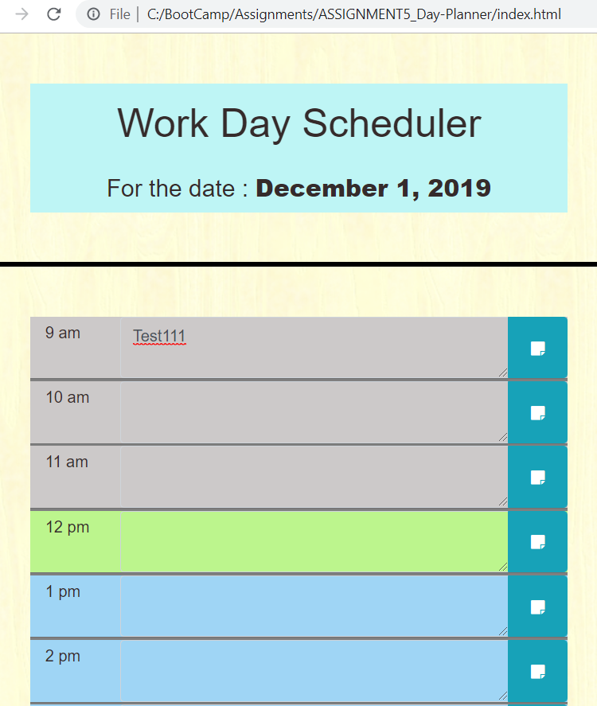

# ASSIGNMENT5_Day-Planner

## This application works as follows

1. Application creates daily planner for the day

2. As per the application settings (currently it is 9 am to 5 pm), it will create sections for each hour
3. User can key in an save tasks for each hour
4. Depending on the hour, application will show different colour for each hour
    i. For all the previous hours other than current hour, it will show grey background
    ii. For current hour, system will show green background
    iii. For futur hours, system will show blue background
5. After refresh or reboot, system will show the saved tasks 
